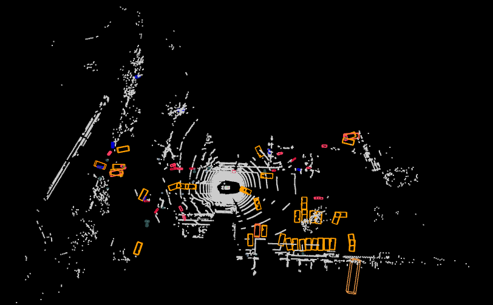

# 3D Object Detection on nuScenes dataset (Proof of Concept)

This repository contains an optimized 3D Object Detection pipeline based on the CenterPoint architecture. Due to strict hardware and time constraints, this Proof of Concept (PoC) was engineered to train, evaluate, and infer using a surgically pruned 8% subset of the nuScenes dataset (Blob 1). 

It features custom data engineering, loss function optimizations, and a custom PyTorch attention module (CBAM) injected into the SECONDFPN neck.

# Architectural Enhancements
There are two crucial enhancements that were implemented.
## CBAM Attention Neck

Convolution Block Attention Module (CBAM) applies both spatial and channel-wise attention to Bird's Eye View (BEV) feature maps. It forces the network to dynamically focus on critical foreground point cloud clusters (like vehicles) while actively suppressing background LiDAR noise.

Wrote a custom PyTorch class in `mmdet3d/models/necks/second_fpn.py` that injects a Convolutional Block Attention Module into the BEV feature extractor.

## Smooth L1 Optimization

This adjustement prevents the harsh gradient updates (regression jitter) caused by noisy or outlier LiDAR points during fine-tuning. It results in a much more stable training curve and tighter, more accurate 3D bounding box localization.

Altered the bounding box loss function from standard L1 to Smooth L1 to prevent regression jitter during fine-tuning. 

## 3D LiDAR Bounding Box Visualizations


### Performance Metrics (Blob 1 Subset)
| Phase | Loss Function | Neck Architecture | NDS | mAP |
| :--- | :--- | :--- | :--- | :--- |
| **Pretrained Baseline** | L1 Loss | SECONDFPN | ~0.636 | ~0.554 |
| **Optimization PoC** | **Smooth L1** | SECONDFPN | **0.572** | **0.473** |
| **Innovation PoC** | Smooth L1 | **CBAM SECONDFPN** | **0.565** | **0.453** |

*Note: Models were incrementally fine-tuned for 20 epochs on a constrained dataset (85 scenes). The temporary metric drop during the CBAM Attention phase reflects expected gradient shock on uninitialized layers, successfully validating the forward/backward pass architecture for future cluster scaling.*

---

## Environment Setup

1. **Create and activate the virtual environment:**
```bash
python -m venv .venv
source .venv/bin/activate
python -m pip install --upgrade pip
```

2. **Install core dependencies:**
```bash
pip install --no-cache-dir -r requirements.txt
```

3. **Install OpenMMLab frameworks (CUDA 12.1 compatible):**
```bash
mim install mmengine "mmcv==2.1.0" "mmdet>=3.2.0"
```

4. **Install this PoC repository as an editable package**
```bash
pip install "setuptools==69.5.1"
cd mmdetection3d
pip install -e . --no-build-isolation
```

---

## Data Preparation & Engineering

Download the `trainval` metadata and `trainval` dataset (only **blob 1** was used for this work) into the `mmdetection3d/data/nuscenes` directory:
```bash
mkdir -p data/nuscenes
cd data/nuscenes
tar -xf v1.0-trainval_meta.tgz
tar -xf v1.0-trainval_01_blobs.tgz
```

### Generating the Pruned Database
Because we are operating on a subset of the data, standard dataloaders will crash looking for missing files. First, generate the base `.pkl` database (Requires ~32GB RAM):
```bash
cd mmdetection3d
python tools/create_data.py nuscenes \
    --root-path ./data/nuscenes \
    --out-dir ./data/nuscenes \
    --extra-tag nuscenes \
    --version v1.0
```

Next, run the custom pruning script (present in root directory) to filter out metadata for any `.bin` files not present in Blob 1:
```bash
python prune_nuscenes.py
```
*This generates `nuscenes_infos_train_pruned.pkl` and `nuscenes_infos_val_pruned.pkl`, which should be updated in the config python file before training or evaluation.*

---

## Execution Pipeline

### 1. Training (Fine-Tuning)
To train the model on the pruned dataset (takes ~12 hours on an L40S GPU with 64GB RAM):
```bash
cd mmdetection3d
python tools/train.py \
    checkpoints/centerpoint_voxel01_second_secfpn_head-circlenms_8xb4-cyclic-20e_nus-3d.py \
    --work-dir work_dirs/CBAM_run
```
*Make sure to update the config file:*
*1. Point to pruned .pkl files instead of the regular .pkl files.*
*2. set 'load_from' variable to correct previous model checkpoint (.pth file).*

### 2. Evaluation
To evaluate local validation metrics against a specific checkpoint:
```bash
cd mmdetection3d
python tools/test.py \
    checkpoints/centerpoint_voxel01_second_secfpn_head-circlenms_8xb4-cyclic-20e_nus-3d.py \
    work_dirs/centerpoint_voxel01_second_secfpn_head-circlenms_8xb4-cyclic-20e_nus-3d/epoch_20.pth \
    --work-dir work_dirs/val_report 
```

### 3. Test Set Submission Generation
To generate the official `results_nusc.json` for the EvalAI leaderboard, the config is pointed to the unpruned test `.pkl` and evaluation is bypassed:
```bash
cd mmdetection3d
python tools/test.py \
    checkpoints/centerpoint_voxel01_second_secfpn_head-circlenms_8xb4-cyclic-20e_nus-3d.py \
    work_dirs/CBAM_run/epoch_20.pth
```
*Update the config file to point to test pkl file and uncomment format_only and jsonfile_prefix line in test_evaluator block*

---